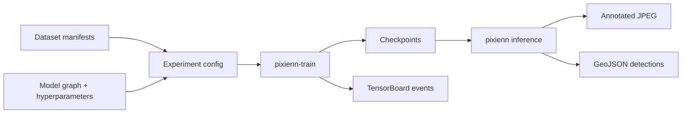

<p align="center">
  
</p>

<p align="center">
  <strong>C++20</strong> &nbsp;•&nbsp;
  <strong>CUDA + cuDNN</strong> &nbsp;•&nbsp;
  <strong>YOLO models</strong> &nbsp;•&nbsp;
  <strong>TensorBoard metrics</strong> &nbsp;•&nbsp;
  <strong>Apache 2.0</strong>
</p>

<p align="center">
  <strong>A compact C++20 neural-network engine for CUDA-accelerated object detection.</strong><br>
  Train, validate, inspect, and run YOLO-style models without hiding the machinery behind a framework.
</p>

<p align="center">
  <a href="#why-pixienn">Why PixieNN?</a> ·
  <a href="#see-it-work">Demo</a> ·
  <a href="#models">Models</a> ·
  <a href="#quick-start">Quick start</a> ·
  <a href="#training-without-the-guesswork">Training</a> ·
  <a href="#how-it-fits-together">Architecture</a>
</p>

## Why PixieNN?

PixieNN is a modern rethinking of the ideas behind Darknet: small enough to understand, direct enough to debug, and capable of running the complete object-detection workflow in native code.

| | |
|---|---|
| **Native performance** | C++20, CUDA, cuDNN, and OpenBLAS execution paths—without a Python runtime in the training or inference loop. |
| **The whole workflow** | Training, validation, checkpointing, TensorBoard events, image inference, non-max suppression, and GeoJSON predictions. |
| **Readable experiments** | Human-editable YAML describes model graphs, optimizer settings, augmentation, datasets, and learning-rate schedules. |
| **Reproducible runs** | GPU/data preflight checks, isolated run directories, metadata, logs, safe restart behavior, and explicit checkpoint resume. |

PixieNN is under active development. Its goal is not to impersonate a mature Python ecosystem; it is to offer a focused, inspectable native engine where model behavior can be traced all the way down to the kernels.

## See it work

<p align="center">
  
  <br>
  <sub>YOLOv3-tiny inference: bounding boxes are rendered to JPEG while the same detections are exported as GeoJSON.</sub>
</p>

## Models

The repository includes model graphs and runnable presets spanning small experiments through larger detectors.

| Family | Included preset | Intended use |
|---|---|---|
| YOLOv1 | `yolov1-tiny` | Compact VOC training and architecture experiments |
| Tiny YOLO | `tiny-yolo-voc` | Small VOC smoke tests |
| YOLO Nano | `yolo-nano` | Minimal detector experiments on VOC |
| YOLOv3 Tiny | `yolov3-tiny`, `yolov3-tiny-voc` | Fast COCO smoke tests or full VOC training |
| YOLOv3 | `yolov3` | Larger COCO model graph |
| YOLOv7-style | `yolov7` | Larger COCO training preset |
| ResNet-18 | model definition included | Classification and layer coverage |

> [!NOTE]
> Model definitions describe PixieNN graphs and training presets. They should not be read as claims of published reference-paper accuracy. Reproducible benchmark checkpoints and PR curves are a project milestone, not a fabricated checkbox.

## Quick start

### 1. Build the CUDA engine

```bash
git clone https://github.com/trieck/pixienn.git
cd pixienn

cmake -S . -B build \
  -DUSE_CUDA=ON \
  -DCMAKE_BUILD_TYPE=Release
cmake --build build --parallel
```

The main executables are written to `build/bin/`:

- `pixienn` — image inference
- `pixienn-train` — model training and validation
- `pixienn-test` — the native test suite

Run the tests with:

```bash
./build/bin/pixienn-test --gtest_brief=1
```

### 2. Run an inference example

Download the original YOLOv3-tiny Darknet weights:

```bash
mkdir -p resources/weights
curl -L https://pjreddie.com/media/files/yolov3-tiny.weights \
  -o resources/weights/yolov3-tiny.weights
```

Then run PixieNN from the repository root:

```bash
./build/bin/pixienn \
  --confidence=0.20 \
  --nms=0.40 \
  resources/cfg/yolov3-tiny-cfg.yml \
  resources/images/dog.jpg
```

This writes `predictions.jpg` and `predictions.geojson` to the current directory.

## Training without the guesswork

The training wrappers standardize the parts of long-running GPU jobs that are easy to get wrong: executable selection, CUDA linkage, input manifests, stale output, logs, metadata, checkpoints, locking, and resume behavior.

List every available preset:

```bash
./shell/train-model.sh --list
```

Start a clean run after verifying every training and validation sample:

```bash
./shell/train-model.sh yolov7 --fresh --verify-data
```

Resume the latest complete checkpoint:

```bash
./shell/train-model.sh yolov7 --resume
```

Run all configured models sequentially:

```bash
./shell/train-all-models.sh --fresh --verify-data
```

The wrappers deliberately reject CPU-only binaries. A run is organized for both humans and tooling:

```text
runs/
├── archive/                       # complete older runs preserved by --fresh
│   └── yolov7-<timestamp>/
└── yolov7/
    ├── backup/                    # rolling checkpoints
    ├── run-metadata.txt           # command, host, GPU, revision, and start time
    ├── training.log               # captured console output
    ├── events.out.tfevents.*
    └── *.weights                  # primary/final weights
```

Monitor every active run with TensorBoard:

```bash
tensorboard --logdir=runs
```

PixieNN currently reports training/validation loss, IoU, recall, micro-averaged F1, and mAP at IoU 0.50. Do not confuse the latter with COCO's stricter mAP averaged from IoU 0.50 through 0.95.

For preset overrides, data-manifest rules, dry runs, locking, and cleanup semantics, read the **[training guide](shell/TRAINING.md)**.

## How it fits together


```mermaid
flowchart LR
    A[Dataset manifests] --> C[Experiment config]
    B[Model graph + hyperparameters] --> C
    C --> D[pixienn-train]
    D --> E[Checkpoints]
    D --> F[TensorBoard events]
    E --> G[pixienn inference]
    G --> H[Annotated JPEG]
    G --> I[GeoJSON detections]
```

- `resources/cfg/` binds a model to weights, labels, and train/validation manifests.
- `resources/models/` defines the layer graph and training hyperparameters.
- `include/` contains the engine, CUDA layers, optimizers, metrics, and data pipeline.
- `src/` provides the CLI entry points and concrete implementation units.
- `shell/` contains reproducible training and dataset utilities.
- `tests/` exercises layers, training behavior, metrics, serialization, and scripts.

## Requirements

| Core | GPU acceleration | Image and configuration |
|---|---|---|
| CMake 3.15+ | NVIDIA CUDA Toolkit | OpenCV 4.5.4+ |
| C++20 compiler | cuDNN 8+ | LibTIFF |
| Boost 1.74+ | Compatible NVIDIA driver | yaml-cpp |
| OpenBLAS |  | nlohmann/json 3.10.5+ |
| Protobuf 3.12.4+ |  | GLib and HarfBuzz |

Cairo and Pango are optional visualization dependencies. CUDA is optional at build time, but it is required by the guarded training wrappers documented above.

## Configuration at a glance

A run is split into two YAML files so datasets and model internals remain independently reusable:

```yaml
# resources/cfg/<experiment>-cfg.yml
configuration:
  model: ../models/<model>.yml
  weights: ../weights/<checkpoint>.weights
  labels: ../data/<dataset>/labels.txt

training:
  train-images: ../data/<dataset>/train.txt
  train-labels: ../data/<dataset>/labels/train
  val-images: ../data/<dataset>/val.txt
  val-labels: ../data/<dataset>/labels/val
```

The model YAML controls layers, batch sizing, augmentation, validation cadence, optimizer parameters, learning-rate policy, checkpointing, and early stopping. Start with an included preset; then change one variable at a time and preserve the generated run metadata.

## Project direction

The next meaningful milestones are evidence, not feature-count theater:

- publish reproducible checkpoints and precision–recall curves;
- add standards-compliant COCO mAP50–95 evaluation;
- document GPU throughput and memory benchmarks;
- expand end-to-end training regression coverage;
- continue simplifying the path from YAML to kernel execution.

## Contributing

Bug reports, focused pull requests, reproducible training observations, and new tests are welcome. When reporting training behavior, include the model/config YAML, GPU model, command line, relevant `run-metadata.txt`, and a short TensorBoard export whenever possible.

PixieNN was inspired by Darknet's directness and its enduring contribution to real-time object detection. Source files are distributed under the Apache License 2.0.

<p align="center">
  <strong>If an understandable native training engine is useful to you, give PixieNN a ⭐ and help test it on new hardware and datasets.</strong>
</p>
