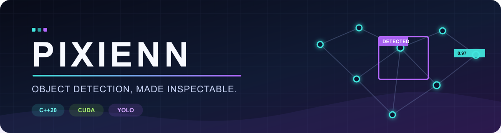
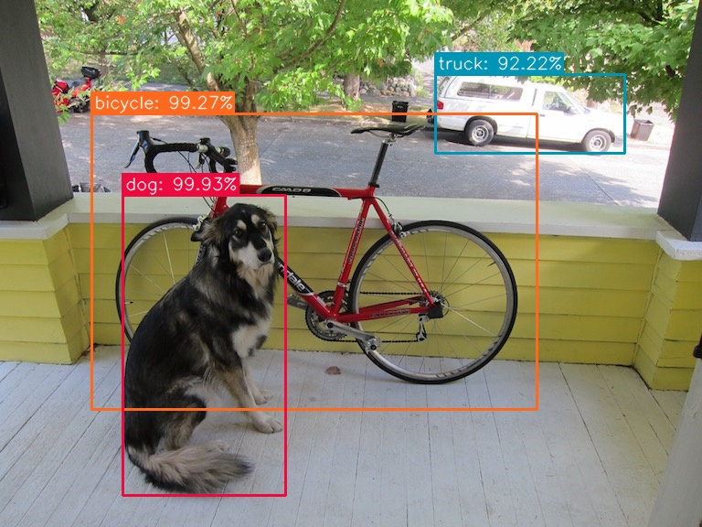
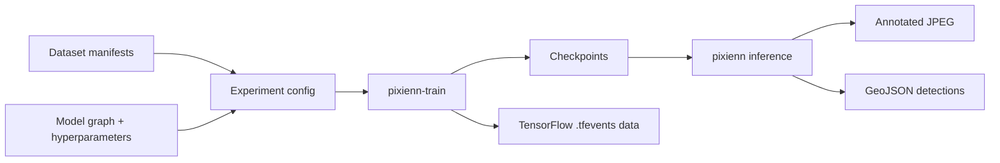

<p align="center">
  
</p>

<p align="center">
  <strong>C++20</strong> &nbsp;•&nbsp;
  <strong>CUDA + cuDNN</strong> &nbsp;•&nbsp;
  <strong>YOLO models</strong> &nbsp;•&nbsp;
  <strong>TensorFlow event metrics</strong> &nbsp;•&nbsp;
  <strong>Apache 2.0</strong>
</p>

<p align="center">
  <strong>A compact C++20 neural-network engine for CUDA-accelerated object detection.</strong><br>
  Train, validate, inspect, and run YOLO-style models without hiding the machinery behind a framework.
</p>

<p align="center">
  <a href="#why-pixienn">Why PixieNN?</a> ·
  <a href="#see-it-work">Demo</a> ·
  <a href="#models">Models</a> ·
  <a href="#quick-start">Quick start</a> ·
  <a href="#training-without-the-guesswork">Training</a> ·
  <a href="#how-it-fits-together">Architecture</a>
</p>

## Why PixieNN?

PixieNN is a modern rethinking of the ideas behind Darknet: small enough to understand, direct enough to debug, and capable of running the complete object-detection workflow in native code.

| | |
|---|---|
| **Native performance** | C++20, CUDA, cuDNN, and OpenBLAS execution paths—without a Python runtime in the training or inference loop. |
| **The whole workflow** | Training, validation, checkpointing, TensorFlow `.tfevents` data, image inference, non-max suppression, and GeoJSON predictions. |
| **Readable experiments** | Human-editable YAML describes model graphs, optimizer settings, augmentation, datasets, and learning-rate schedules. |
| **Reproducible runs** | GPU/data preflight checks, isolated run directories, metadata, logs, safe restart behavior, and explicit checkpoint resume. |

PixieNN is under active development. Its goal is not to impersonate a mature Python ecosystem; it is to offer a focused, inspectable native engine where model behavior can be traced all the way down to the kernels.

## See it work

<p align="center">
  
  <br>
  <sub>YOLOv3-tiny inference: bounding boxes are rendered to JPEG while the same detections are exported as GeoJSON.</sub>
</p>

## Models

The repository includes model graphs and runnable presets spanning small experiments through larger detectors.

| Family | Included preset | Intended use |
|---|---|---|
| CenterNet | `centernet-smoke-voc`, `centernet-tiny-voc` | Anchor-free VOC pipeline checks and training |
| YOLOv1 | `yolov1-tiny` | Compact VOC training and architecture experiments |
| YOLOv2 | `yolov2` | YOLOv2-style anchor-based VOC smoke tests |
| YOLO Nano | `yolo-nano` | Minimal detector experiments on VOC |
| YOLOv3 Tiny | `yolov3-tiny`, `yolov3-tiny-voc` | Fast COCO smoke tests or full VOC training |
| YOLOv3 | `yolov3` | Larger COCO model graph |
| YOLOv7-style | `yolov7` | Larger COCO training preset |
| ResNet-18 | model definition included | Classification and layer coverage |

> [!NOTE]
> Model definitions describe PixieNN graphs and training presets. They should not be read as claims of published reference-paper accuracy. Reproducible benchmark checkpoints and PR curves are a project milestone, not a fabricated checkbox.

### Anchor-free CenterNet experiments

The CenterNet head provides a deliberately different detector for comparison
with the YOLO families. It treats objects as center points and predicts a
per-class center heatmap, normalized box width and height, and a fractional
center offset. This removes anchor configuration from the experiment and makes
the learned heatmaps directly inspectable.

Use `centernet-smoke-voc` to verify the complete target, loss, checkpoint, and
decode pipeline on a small network. Use `centernet-tiny-voc` for a real VOC
experiment. The current CUDA implementation performs the CenterNet head math on
the host while the convolutional backbone remains CUDA-accelerated; it favors a
clear, testable reference implementation over peak head throughput.

Read **[CenterNet: Objects as Glowing Points](docs/CENTERNET.md)** for a visual,
beginner-friendly tour of heatmaps, center offsets, box reconstruction, and how
the anchor-free approach differs from YOLO.

## Quick start

### 1. Build the CUDA engine

```bash
git clone https://github.com/trieck/pixienn.git
cd pixienn

cmake -S . -B build \
  -DUSE_CUDA=ON \
  -DCMAKE_BUILD_TYPE=Release
cmake --build build --parallel
```

The main executables are written to `build/bin/`:

- `pixienn` — image inference
- `pixienn-train` — model training and validation
- `pixienn-test` — the native test suite

Run the tests with:

```bash
./build/bin/pixienn-test --gtest_brief=1
```

### 2. Run an inference example

Download the original YOLOv3-tiny Darknet weights:

```bash
mkdir -p resources/weights
curl -L https://pjreddie.com/media/files/yolov3-tiny.weights \
  -o resources/weights/yolov3-tiny.weights
```

Then run PixieNN from the repository root:

```bash
./build/bin/pixienn \
  --confidence=0.20 \
  --nms=0.40 \
  resources/cfg/yolov3-tiny-cfg.yml \
  resources/images/dog.jpg
```

This writes `predictions.jpg` and `predictions.geojson` to the current directory.

### Inspect predictions in QGIS

GeoJSON is an intentional visualization format in PixieNN, not just a generic
JSON export. It lets the detection boxes be loaded as a vector layer over the
original, non-georeferenced image in [QGIS](https://qgis.org/). Each prediction
is a polygon whose attributes include the class, confidence, and batch ID, so
boxes can be inspected, filtered, styled, and compared without flattening them
into the rendered JPEG.

1. Add the inference image to QGIS as a raster layer.
2. Add `predictions.geojson` as a vector layer.
3. Keep both layers in their local, non-georeferenced image coordinate space.
4. Style or filter the vector layer using its `class` and `confidence`
   attributes.

Image coordinates normally begin at the upper-left and increase downward.
PixieNN writes negative GeoJSON Y coordinates so the polygons align with the
way QGIS displays an unreferenced raster in its Cartesian canvas. The export is
therefore intended for local image inspection; its coordinates are pixel-space
geometry, not longitude and latitude.

## Training without the guesswork

The training wrappers standardize the parts of long-running GPU jobs that are easy to get wrong: executable selection, CUDA linkage, input manifests, stale output, logs, metadata, checkpoints, locking, and resume behavior.

List every available preset:

```bash
./shell/train-model.sh --list
```

Start a clean run after verifying every training and validation sample:

```bash
./shell/train-model.sh yolov7 --fresh --verify-data
```

Resume the latest complete checkpoint:

```bash
./shell/train-model.sh yolov7 --resume
```

Run all configured models sequentially:

```bash
./shell/train-all-models.sh --fresh --verify-data
```

The wrappers deliberately reject CPU-only binaries. A run is organized for both humans and tooling:

```text
runs/
├── archive/                       # complete older runs preserved by --fresh
│   └── yolov7-<timestamp>/
└── yolov7/
    ├── backup/                    # rolling checkpoints
    ├── run-metadata.txt           # command, host, GPU, revision, and start time
    ├── training.log               # captured console output
    ├── tensorboard.log            # TensorBoard server output
    ├── tensorboard.pid            # automatically started server PID
    ├── events.out.tfevents.*
    └── *.weights                  # primary/final weights
```

The wrapper starts TensorBoard automatically and prints a clickable URL:

```text
TensorBoard: http://localhost:6006/
```

With `--fresh`, it stops an existing TensorBoard instance on that port and
removes this model's previous event files before starting the clean run. Set
`PIXIENN_TENSORBOARD_PORT` to use a different port.

PixieNN currently reports training/validation loss, IoU, recall, micro-averaged F1, and mAP at IoU 0.50. Do not confuse the latter with COCO's stricter mAP averaged from IoU 0.50 through 0.95.

For preset overrides, data-manifest rules, dry runs, locking, and cleanup semantics, read the **[training guide](shell/TRAINING.md)**.

### Monitor a run in the React dashboard

The repository includes a local React dashboard for TensorFlow `.tfevents`
protocol-buffer data,
run metadata, and checkpoints. Start it from the repository root:

```bash
cd monitor
npm install
npm run dev
```

Open [http://localhost:4173](http://localhost:4173). The dashboard refreshes
every 2.5 seconds and shows the current run status, optimizer step, loss,
learning rate, latest checkpoint, metadata, full-run loss trace, and
auto-scaled scalar cards sourced from the event files. The charts span the
entire run automatically; the renderer keeps its display resolution bounded as
the event file grows. The average-loss chart also supports exact recent-step
windows of 10,000, 2,000, or 500 optimizer steps. Use the run selector to inspect
another directory under `runs/`.

The monitor reads local event/metadata files through its local-only API; it
does not upload logs or expose arbitrary filesystem paths. TensorBoard remains
available at the separate URL printed by the training wrapper, normally
`http://localhost:6006/`.

## How it fits together


```mermaid
flowchart LR
    A[Dataset manifests] --> C[Experiment config]
    B[Model graph + hyperparameters] --> C
    C --> D[pixienn-train]
    D --> E[Checkpoints]
    D --> F[TensorFlow .tfevents data]
    E --> G[pixienn inference]
    G --> H[Annotated JPEG]
    G --> I[GeoJSON detections]
```

- `resources/cfg/` binds a model to weights, labels, and train/validation manifests.
- `resources/models/` defines the layer graph and training hyperparameters.
- `include/` contains the engine, CUDA layers, optimizers, metrics, and data pipeline.
- `src/` provides the CLI entry points and concrete implementation units.
- `shell/` contains reproducible training and dataset utilities.
- `tests/` exercises layers, training behavior, metrics, serialization, and scripts.

## Requirements

| Core | GPU acceleration | Image and configuration |
|---|---|---|
| CMake 3.15+ | NVIDIA CUDA Toolkit | OpenCV 4.5.4+ |
| C++20 compiler | cuDNN 8+ | LibTIFF |
| Boost 1.74+ | Compatible NVIDIA driver | yaml-cpp |
| OpenBLAS |  | nlohmann/json 3.10.5+ |
| Protobuf 3.12.4+ |  | GLib and HarfBuzz |

Cairo and Pango are optional visualization dependencies. CUDA is optional at build time, but it is required by the guarded training wrappers documented above.

## Configuration at a glance

A run is split into two YAML files so datasets and model internals remain independently reusable:

```yaml
# resources/cfg/<experiment>-cfg.yml
configuration:
  model: ../models/<model>.yml
  weights: ../weights/<checkpoint>.weights
  labels: ../data/<dataset>/labels.txt

training:
  train-images: ../data/<dataset>/train.txt
  train-labels: ../data/<dataset>/labels/train
  val-images: ../data/<dataset>/val.txt
  val-labels: ../data/<dataset>/labels/val
```

The model YAML controls layers, batch sizing, augmentation, validation cadence, optimizer parameters, learning-rate policy, checkpointing, and early stopping. Start with an included preset; then change one variable at a time and preserve the generated run metadata.

## Project direction

The next meaningful milestones are evidence, not feature-count theater:

- publish reproducible checkpoints and precision–recall curves;
- add standards-compliant COCO mAP50–95 evaluation;
- document GPU throughput and memory benchmarks;
- expand end-to-end training regression coverage;
- continue simplifying the path from YAML to kernel execution.

## Contributing

Bug reports, focused pull requests, reproducible training observations, and new tests are welcome. When reporting training behavior, include the model/config YAML, GPU model, command line, relevant `run-metadata.txt`, and a short event-file export whenever possible.

PixieNN was inspired by Darknet's directness and its enduring contribution to real-time object detection. Source files are distributed under the Apache License 2.0.

<p align="center">
  <strong>If an understandable native training engine is useful to you, give PixieNN a ⭐ and help test it on new hardware and datasets.</strong>
</p>
