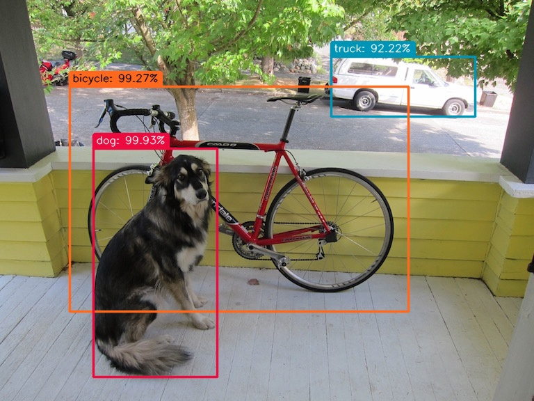

# PIXIENN

## A modern C++ re-implementation of Darknet.




## Overview

This project aims to provide a modern C++ implementation of the Darknet neural network framework, focusing
on efficient training and inference with CUDA support.

## Features

- **CUDA Support:** Utilize the power of NVIDIA GPUs for accelerated neural network training and inference.
- **Model Compatibility:** Successfully tested with YOLOv1-tiny, YOLOv3-tiny, and YOLOv3 models and ResNet18.
- **Performance:** Significantly reduced inference time on CPU compared to the original Darknet implementation.
- **Modern C++ Features:** Leveraging modern C++ standards for improved maintainability.

## Getting Started

### Prerequisites

- Boost (>= 1.74)
- CUDA Toolkit (for GPU support)
- CUDNN8 (for GPU support)
- Cairo (>= 1.16.0) (optional)
- GLib
- LibTIFF
- OpenBLAS library
- OpenCV (>= 4.5.4)
- Pango (optional)
- nlohmann_json (>= 3.10.5)
- yaml-cpp
- Protobuf (>= 3.12.4)

### Installation

```bash
# Clone the repository
git clone https://github.com/trieck/pixienn

# Build the project
cd pixienn
mkdir build
cd build
cmake ..
make
```

### Running inference

In the `bin` directory, you will find the `pixienn` executable. You can use it to run inference on a single image.
The following example shows how to run inference on a single image using the YOLOv3-tiny model:

1.) Download the trained darknet weights file [](https://pjreddie.com/media/files/yolov3-tiny.weights) and place it in
the `resources/weights` directory below the project root.

```bash
./pixienn ../../resources/cfg/yolov3-tiny-cfg.yml ../../resources/images/dog.jpg
```

If all went well, this will produce an image named `predictions.jpg` and a JSON file named `predictions.geojson` in the
current directory. The image will have bounding boxes drawn around the detected objects. The JSON file will contain
the bounding box coordinates and class labels for each detected object.
You should be able to see bounding boxes for a dog and a bicycle and truck in the image.

### Training a model

We will train a YOLOv3-tiny model on the COCO dataset. The easiest thing to do is to follow the instructions on the
darknet
site for downloading the COCO dataset and creating annotations for the training and validation sets.

You must configure the directory paths for the training and validation images and annotations in
the `cfg/yolov3-tiny-cfg.yml`.

You may wish to edit parameters in the model file under `resources/models/yolov3-tiny.yml`.

Once you have configured the paths, you can train your model as follows:

```bash
./pixienn-train ../../resources/cfg/yolov3-tiny-cfg.yml yolov3-tiny.weights
```
#### Monitoring model training

PixieNN uses the [Tensorboard](https://www.tensorflow.org/tensorboard) tool for monitoring model training. You can
start Tensorboard as follows:

```bash
tensorboard --logdir=.
```

