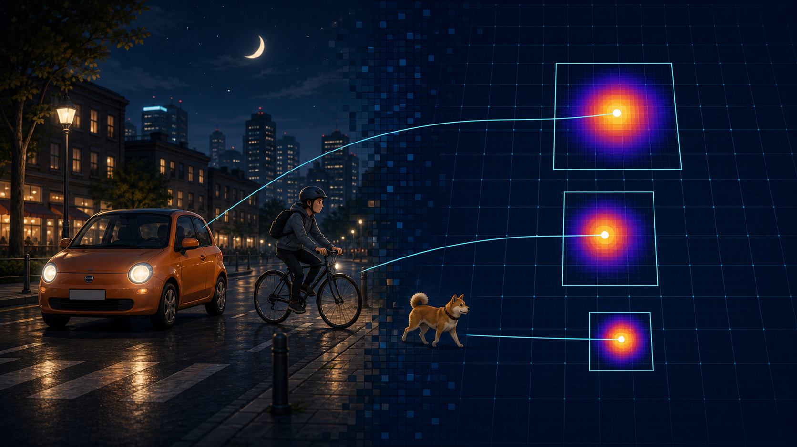
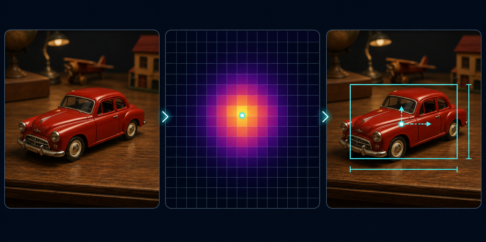
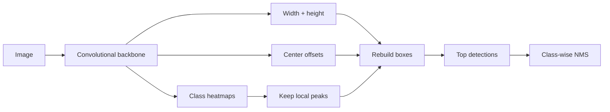

<p align="center">
  
</p>

<h1 align="center">CenterNet: Objects as Glowing Points</h1>

<p align="center">
  <strong>An anchor-free object detector, explained without requiring a machine-learning dictionary.</strong><br>
  See an object. Find its heart. Measure around it. Draw the box.
</p>

---

## The thirty-second idea

Imagine giving someone a photograph and asking them to mark every object with a
glowing sticker placed at its center.

- Put a bright dot in the middle of every dog.
- Put a bright dot in the middle of every car.
- Put a bright dot in the middle of every bicycle.
- Beside each dot, write down how wide and tall the object is.

That is the heart of **CenterNet**. It teaches a neural network to treat each
object as a point, then rebuild the full bounding box around that point.

<p align="center">
  
</p>

The middle panel is the important bit: the model is not searching through a
pile of predefined rectangles. It is looking for a bright peak in a heatmap.

> **CenterNet's tiny philosophy:** first answer _where is it?_; then answer
> _how big is it?_

## What is a heatmap?

A heatmap is simply a grid of confidence values. Dark cells mean “probably
nothing here.” Bright cells mean “look here!”

For object detection, PixieNN creates one heatmap per class:

| Heatmap | Bright spots mean… |
|---|---|
| `dog` | The center of a dog is probably here |
| `car` | The center of a car is probably here |
| `person` | The center of a person is probably here |

The brightest location is the predicted center. During training, the correct
center is not represented by one brutally isolated pixel. PixieNN paints a
small Gaussian glow around it:

```text
quiet background                 object center

0.00  0.01  0.04  0.01  0.00
0.01  0.12  0.35  0.12  0.01
0.04  0.35  1.00  0.35  0.04   ← brightest point
0.01  0.12  0.35  0.12  0.01
0.00  0.01  0.04  0.01  0.00
```

Why a glow instead of a single pixel? Because “very close” should be treated
more kindly than “the other side of the image.” The glow gives the network a
smoother trail toward the right answer.

## The three things PixieNN predicts

For VOC's 20 classes, the final CenterNet layer receives **24 maps**:

```text
20 class heatmaps + 2 size maps + 2 offset maps = 24 maps
```

### 1. Center heatmaps — “What is here?”

Each class gets its own glowing map. A peak says both which class the object
belongs to and where its center is located.

### 2. Width and height — “How big is it?”

At every real object center, the network predicts two numbers: the object's
width and height. Those two measurements expand the center point into a box.

### 3. Center offsets — “Exactly where between the pixels?”

The heatmap is smaller than the input image. In the `centernet-tiny-voc`
preset, a `320 × 320` image becomes an `80 × 80` prediction grid. An object's
true center will often fall between two grid locations.

The offset maps preserve that fractional position:

```text
grid location:    (24, 17)
predicted offset: (0.72, 0.31)
precise center:   (24.72, 17.31)
```

It is the neural-network equivalent of saying, “not just this city block—about
three quarters of the way down it.”

## Turning a glow into a detection

At inference time PixieNN performs a small treasure hunt:



1. Apply a sigmoid so every heatmap score lies between zero and one.
2. Keep only local peaks—a bright cell must beat its immediate neighbors.
3. Discard peaks below the confidence threshold.
4. Read the size and offset values at each surviving peak.
5. Reconstruct the bounding box.
6. Keep the strongest candidates and apply class-wise non-maximum suppression.

The result uses the same detection objects, validation metrics, annotated
JPEGs, and QGIS-friendly GeoJSON output as PixieNN's YOLO detectors.

## How does it learn?

CenterNet has a peculiar classroom problem: nearly the entire heatmap is empty.
If every dark background cell shouted as loudly as a real object, the useful
signal would be buried under millions of easy “nothing here” answers.

PixieNN uses **focal loss** to turn down those easy negatives and concentrate on
hard mistakes. In plain language:

- confident correct background gets very little attention;
- a missed object center gets a lot of attention;
- a false bright spot gets a lot of attention;
- the soft Gaussian shoulder matters, but less than the exact center.

Width, height, and offset use an **L1 loss**: the absolute distance between the
prediction and the correct value. A wrong size receives a direct push toward
the target without squaring the error into something explosive.

The heatmap starts with a deliberately low confidence prior (`-2.19` before
sigmoid). An untrained model therefore begins by saying “probably background”
instead of hallucinating an object in half of all grid cells.

## CenterNet versus YOLO

Both produce boxes and class scores. They disagree about how to get there.

| | CenterNet | YOLO |
|---|---|---|
| Basic unit | Object center | Grid cell + anchor |
| Predefined anchor shapes | None | Yes |
| Main question | “Where is the center?” | “Which anchor best fits?” |
| Box size | Predicted directly | Predicted relative to an anchor |
| Small-object opportunity | High-resolution heatmap | Multi-scale detection heads |
| Awkward case | Two centers in one cell | Two objects competing for one anchor/cell |
| Visual explanation | Glowing class maps | Anchor-relative box predictions |

CenterNet is not automatically “better YOLO.” It is a different set of
tradeoffs. YOLO's anchors provide useful prior knowledge about common shapes.
CenterNet removes that machinery and offers a beautifully direct training
target.

For PixieNN, that difference is the point: the codebase can demonstrate two
genuinely different detection ideas instead of presenting one family of models
at several sizes.

## The crowded-room problem

If two object centers land in the same heatmap cell, both classes can still
receive heatmap peaks—but one cell has only one width, height, and offset pair.
PixieNN records that regression collision and retains the larger box.

This is CenterNet's cousin of YOLO's anchor collision problem. Increasing the
heatmap resolution reduces it; more sophisticated detectors can also use
multiple regression slots or richer assignment strategies.

No detector gets magic for free.

## PixieNN's implementation

The implementation is intentionally compact and inspectable:

- [`CenterNetTargetBuilder`](../include/CenterNetTargetBuilder.h) constructs
  Gaussian heatmaps, feature-map-cell sizes, offsets, masks, and collision counts.
- [`CenterNetLayer`](../include/CenterNetLayer.h) computes focal/L1 losses,
  update directions, local peaks, top detections, and decoded boxes.
- [`CUDA bridge`](../include/cuda/CenterNetLayer.h) keeps the convolutional
  backbone CUDA-accelerated while using proven host reference math for the new
  head.
- [`Native tests`](../tests/src/centernet.cpp) verify heatmap peaks, Gaussian
  shoulders, collisions, invalid classes, and exact box decoding.

The host-side head is a correctness-first reference. Moving its dense math into
CUDA kernels is a future performance optimization, not a requirement for
understanding or validating the algorithm.

## Try it

The smoke preset is deliberately small. It is ideal for proving that the whole
pipeline can overfit a tiny sample:

```bash
./shell/train-model.sh centernet-smoke-voc --fresh --verify-data
```

The real VOC experiment uses the larger `320 × 320` preset:

```bash
./shell/train-model.sh centernet-tiny-voc --fresh --verify-data
```

The wrapper clears the selected model's old TensorBoard events, starts a fresh
TensorBoard server, prints a clickable URL, and launches CUDA training.

## What should we celebrate?

Early success is not a heroic mAP number. Look for evidence in this order:

1. Training and validation loss remain finite and stable.
2. Average recall becomes nonzero and keeps climbing.
3. Micro-averaged F1 rises above noise.
4. Heatmap peaks settle onto real object centers.
5. Box sizes stop being wildly too large or too small.
6. mAP50 improves across several validations—not just one lucky batch.

The most satisfying CenterNet debugging tool is visual: render the heatmap,
find its brightest islands, and ask whether the model is looking in the right
place. Even before its boxes are perfect, you can watch the detector learn
where objects live.

---

<p align="center">
  <strong>Objects become points. Points become peaks. Peaks become boxes.</strong><br>
  That is CenterNet—and now PixieNN can show every step.
</p>
