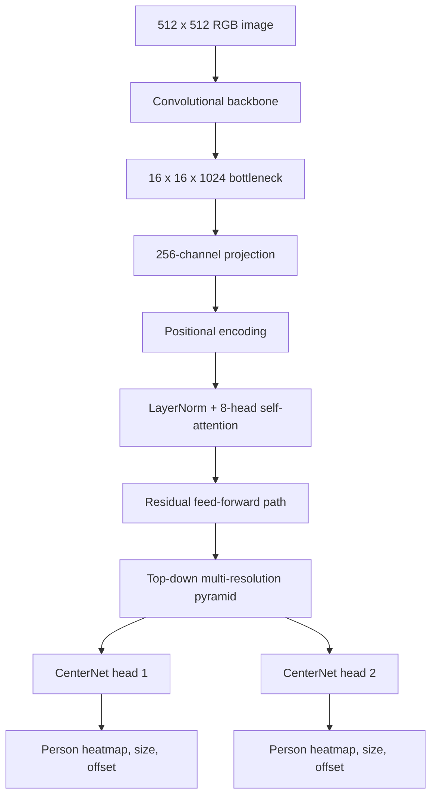

# Prosopo: One-Class Person Detection with Multi-Resolution Feature Fusion and Attention in PixieNN

> **Working draft — not yet a final paper**
>
> This document records the current research question, dataset construction,
> model design, and experimental plan. Numerical comparisons and conclusions
> remain provisional until the controlled experiments described below are
> complete.

## Abstract

Object-detection datasets often combine several object categories even when a
particular application is concerned primarily with people. This work presents
**Prosopo**, a one-class person-detection dataset assembled from locally
available COCO, KITTI, and Pascal VOC images, together with a corresponding
detector implemented in the PixieNN C++ framework. Prosopo maps source-specific
person labels—including COCO `person`, VOC `person`, KITTI `pedestrian`, and
KITTI `person_sitting`—to one canonical class, `person`, while discarding
non-person annotations.

The accompanying detector combines a convolutional backbone, multi-resolution
feature fusion, two CenterNet-style prediction heads, positional encoding,
LayerNorm, and self-attention at the deepest feature-map resolution. The design
tests whether a high-resolution, single-class detector can benefit from global
context without requiring a fully set-based transformer detector.

The paper will compare this model with YOLOv7 and simpler ablations under the
same Prosopo data split and evaluation protocol. The current implementation is
best understood as an experimental research system: the dataset pipeline and
model are implemented, while the final controlled evaluation is still in
progress.

## 1. Introduction

Recognizing people is a useful test of an object detector because the visual
category spans large changes in scale, pose, visibility, lighting, and scene
context. A detector must recognize a person standing close to the camera, a
small distant pedestrian, a seated person, and partially occluded people while
maintaining a manageable false-positive rate.

Most general-purpose detection benchmarks ask a model to distinguish many
categories simultaneously. That is valuable for broad detection, but it makes
it difficult to isolate questions about person detection itself. A model can
spend capacity separating cars, bicycles, animals, and furniture even when the
only target category is a person.

Prosopo asks a narrower question:

> How effective can a detector become when images from several detection
> datasets are unified around one semantic class, and the model is given both
> high-resolution prediction maps and limited global attention?

This study has three goals:

1. construct a reproducible one-class dataset with explicit source provenance;
2. implement a detector that combines convolutional multi-scale processing with
   attention inside PixieNN; and
3. measure which parts of that design actually improve detection quality.

The third goal is important. A higher score from the complete model would not
by itself show that attention caused the improvement. Controlled ablations are
therefore part of the proposed contribution, not an optional follow-up.

## 2. Contributions

The intended contributions of this work are:

- **Prosopo**, a reproducible one-class person dataset assembled from COCO,
  KITTI, and VOC with canonical class naming and source-to-output provenance;
- a PixieNN detector that combines a convolutional backbone, multi-resolution
  fusion, two CenterNet heads, and a compact attention block;
- a from-scratch C++ implementation with CPU and CUDA execution paths and
  tests for the relevant tensor and transformer operations; and
- an empirical comparison of the complete model against YOLOv7 and carefully
  selected architectural ablations.

The results section must determine which of these are demonstrated results and
which remain engineering capabilities.

## 3. Prosopo Dataset

### 3.1 Construction

Prosopo is generated by `resources/data/prosopo/build.py`. The builder reads
the configured source splits, retains images containing people, converts every
retained annotation to class `0`, and writes the canonical name `person` to
`prosopo.names`.

The source mappings are:

| Source | Retained labels | Canonical label |
|---|---|---|
| COCO | `person` | `person` |
| Pascal VOC | `person` | `person` |
| KITTI | `pedestrian`, `person_sitting` | `person` |
| KITTI | `cyclist` excluded | — |

KITTI cyclists are excluded because the source box represents the cyclist and
bicycle together rather than a person-only extent. This decision should be
discussed as a labeling-policy choice and tested for sensitivity if cyclist
images materially affect the data distribution.

### 3.2 Dataset size

The current generated dataset contains:

| Split | Images | Person boxes |
|---|---:|---:|
| Training | 50,343 | 199,470 |
| Diagnostic validation | 1,000 | 4,093 |
| Complete held-out source collection | 23,011 | 92,333 |

The 1,000-image validation list is intended for frequent training diagnostics.
The complete held-out collection must be used for the final reported test
results. It should not be loaded into routine validation all at once.

The dataset manifest records source provenance for every generated image. The
paper should report the exact source versions, split definitions, duplicate
handling, image-resolution distribution, and the proportion of images and
boxes contributed by each source.

### 3.3 Data risks

The merged dataset is not automatically an unbiased sample of the world. COCO
contributes most of the images and boxes, while KITTI contributes a smaller but
important autonomous-driving domain. Source-specific camera geometry,
annotation policy, and scene composition may make a random mixed validation
score look stronger than performance on a particular domain.

For that reason, final evaluation should include both an aggregate score and
source-stratified scores for COCO, KITTI, and VOC.

## 4. Model

### 4.1 Backbone

The configured model accepts a `512 × 512` RGB image and progressively reduces
its spatial resolution while increasing channel capacity. The deepest
convolutional stage has 1,024 channels at a stride of 32. Residual shortcuts
are used within stages.

The backbone is deliberately conventional: it provides a strong spatial and
semantic feature hierarchy before the experimental components are introduced.

### 4.2 Attention enhancement

At the stride-32 bottleneck, a 1×1 convolution reduces the representation to
256 channels. The resulting `16 × 16` feature map is augmented with positional
encoding, normalized with LayerNorm, and processed by eight-head self-attention.
The attention output is returned through a residual path and followed by a
small feed-forward projection before being reintroduced into the feature
pyramid.

Intuitively, the convolutional backbone answers local questions such as “what
visual pattern is in this neighborhood?” Self-attention allows one location
to compare itself with every other location in the 16×16 map. This may help
when a person is small, occluded, or visually ambiguous but the surrounding
scene provides useful context.

The attention block is intentionally placed at low spatial resolution. Global
attention at the original image resolution would be substantially more
expensive, while attention at 16×16 can still exchange scene-level information.

### 4.3 Multi-resolution fusion

The decoder forms a top-down pyramid. Deep semantic features are upsampled and
merged with earlier feature maps at progressively finer resolutions. This
combines:

- deep, context-rich features useful for large or occluded people;
- intermediate-resolution features useful for ordinary detections; and
- high-resolution features useful for small or distant people.

The final representation is used by two CenterNet heads. Each head predicts a
one-channel person heatmap, two size values, and two center-offset values.

### 4.4 Detection representation

CenterNet represents each person by the center of its bounding box. The model
predicts:

1. a heatmap peak indicating the person's center;
2. width and height at that center; and
3. a sub-pixel center offset to recover the precise image location.

This avoids anchor-shape design and makes the one-class output especially
simple. The tradeoff is that two objects whose centers collide at one output
location compete for the same regression values.

## 5. Experimental Methodology

The primary comparison will train CenterNet-Prosopo and YOLOv7 on the same
Prosopo training list and evaluate them on the same held-out images. Unless a
model-specific constraint makes this impossible, the comparison should use the
same image resolution, data augmentation policy, training budget, validation
images, and confidence/IoU evaluation thresholds.

The primary metrics are:

- mAP at IoU 0.50;
- precision;
- recall;
- F1 at the selected operating threshold;
- precision-recall curves and area under the curve;
- inference throughput and latency; and
- trainable parameter count and peak memory.

### 5.1 Required ablations

| Experiment | Multi-scale fusion | Attention | Purpose |
|---|---:|---:|---|
| A | No | No | convolutional baseline |
| B | Yes | No | measure the value of resolution fusion |
| C | No | Yes | measure the value of attention alone |
| D | Yes | Yes | complete CenterNet-Prosopo model |
| E | Yes | Yes | YOLOv7 comparison under the same protocol |

The exact baseline configurations must be archived with their weights and
commit identifiers. A route or topology correction must never be silently
mixed into an architectural comparison; if the graph changes, it becomes a
separate experimental factor.

### 5.2 Statistical reporting

At minimum, the paper should report results from three independent seeds for
the principal comparisons, with mean and standard deviation. Per-source
results should be reported separately because the merged validation score may
hide domain-specific failures.

## 6. Current Status and Limitations

The Prosopo dataset builder, model configuration, transformer components, and
training integration exist in PixieNN. The final scientific claim is not yet
established because the controlled baseline and ablation matrix has not been
completed.

The current architecture is also substantially more computationally expensive
than the configured YOLOv7 graph. That cost may be justified if it produces a
meaningful improvement in recall or mAP, but it must be measured rather than
assumed.

Important limitations include:

- source-domain imbalance in the merged dataset;
- possible differences in annotation policy between COCO, KITTI, and VOC;
- a diagnostic validation list that is smaller than the complete held-out set;
- no demonstrated multi-seed confidence intervals yet; and
- no claim yet that self-attention, rather than additional capacity or altered
  routing, caused any observed improvement.

## 7. Results Placeholder

This section will be completed after the controlled experiments.

| Model | mAP50 | Precision | Recall | F1 | Params | Latency |
|---|---:|---:|---:|---:|---:|---:|
| CenterNet baseline | TBD | TBD | TBD | TBD | TBD | TBD |
| CenterNet + fusion | TBD | TBD | TBD | TBD | TBD | TBD |
| CenterNet + fusion + attention | TBD | TBD | TBD | TBD | TBD | TBD |
| YOLOv7 | TBD | TBD | TBD | TBD | TBD | TBD |

No conclusion should be drawn from this table until all models have been
evaluated under the same protocol.

## 8. Reproducibility Checklist

Before submission, archive:

- the Prosopo manifest and generated split files;
- dataset-builder version and source dataset versions;
- every model YAML and training configuration;
- model weights for the best and final checkpoints;
- training logs and validation predictions;
- random seeds;
- compiler, CUDA, GPU, and operating-system details;
- exact Git commit identifiers; and
- scripts that regenerate tables and figures from recorded metrics.

## 9. Planned Conclusion

The eventual conclusion should answer a narrow empirical question: whether
multi-resolution fusion and compact bottleneck attention provide a worthwhile
accuracy improvement for one-class person detection when compared with a
convolutional baseline and YOLOv7. If the accuracy gain is small relative to
the computational cost, that is still a useful result. It would identify the
conditions under which the additional architectural complexity is—or is not—a
good engineering tradeoff.

