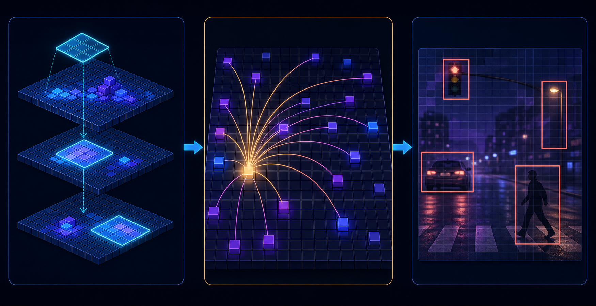

<p align="center">
  
</p>

<h1 align="center">Adding Transformer Capabilities to PixieNN</h1>

<p align="center">
  <strong>Let distant image regions communicate without losing the detector PixieNN already knows how to run.</strong><br>
  An engineering explanation of attention, tensor shapes, implementation, and validation.
</p>

---

## The thirty-second idea

PixieNN already uses convolutional layers to look at an image. A convolution
looks at a small neighborhood at a time. As the image travels through the
backbone, those neighborhoods gradually become larger, so later features can
describe larger pieces of the scene.

A transformer adds a different kind of conversation:

> A feature at one location can directly ask other locations in the image for
> useful information.

For example, a small feature that looks like a pedestrian might use information
from the road, nearby people, vehicle shapes, and the surrounding scene before
the detector decides what it is.

This is usually called **self-attention**. The word “self” means that the
features in one image attend to other features from that same image. The
network is not downloading information from anywhere else; it is rearranging
and combining information it already extracted from the image.

Adding transformer capabilities to PixieNN would not mean throwing away one
detector family or replacing the current detector with a completely different
research system. PixieNN supports several detector families, including multiple
YOLO generations and anchor-free designs. The practical first version should
preserve the native detector contract:

```text
image
  ↓
convolutional backbone
  ↓
coarse feature map
  ↓
one lightweight self-attention block
  ↓
existing feature-fusion path
  ↓
existing detector heads
  ↓
boxes
```

The current COCO model is an excellent place to experiment because it already
has a working multi-scale backbone and native detection heads. We can add
global context while keeping the successful detection and validation machinery
unchanged. The same layer should ultimately be usable wherever a compatible
feature map exists, regardless of detector family.

## What a transformer contributes

### Convolution: “look nearby”

A 3×3 convolution examines a small square around each feature location. The
same operation is repeated over the whole feature map.

That is very good for edges, corners, textures, local shape, and small object
parts. But a convolution does not immediately connect the top-left corner of an
image to the bottom-right corner. More layers are needed before information can
travel that far.

### Attention: “look where it matters”

Self-attention lets every feature location compare itself with every other
location in the chosen feature map. It can learn that a feature should pay
attention to:

- another part of the same object;
- a repeated object elsewhere in the image;
- a road or sidewalk region;
- a nearby object that provides context;
- a distant feature with a similar appearance.

The result is not a new detection by itself. It is a better-informed feature map
that the existing detector head can use.

<p align="center">
  
</p>

The middle panel captures the central change: convolution naturally gathers
nearby evidence, while attention can connect one location to distant locations
when the learned similarities say that the connection is useful. The final
detector head still produces the model's native predictions.

### Transformer: attention plus a small processing block

In this document, “transformer” means a compact encoder block containing:

1. positional information;
2. multi-head self-attention;
3. a residual connection;
4. a feed-forward network applied independently at each location;
5. another residual connection;
6. normalization around those operations.

Attention provides communication between locations. The feed-forward network
then gives each location room to transform what it learned. The residual paths
help the block preserve useful CNN features while it learns the new behavior.

The complete information path is:


The arrows are not a replacement for the residual shortcuts: the attention and
feed-forward branches each add their result back to the features they received.
That is what lets the new block behave as a refinement instead of forcing the
rest of the detector to learn from an entirely unfamiliar representation.

## What we should not build first

Several ideas are related to transformers but are much larger projects than the
first PixieNN experiment:

- a full DETR detector;
- a transformer-only image backbone;
- encoder-decoder cross-attention;
- object queries and Hungarian matching;
- a feature pyramid made entirely from attention blocks;
- windowed attention at every backbone scale;
- a pretrained vision transformer with a new weight format;
- a language-and-vision multimodal model.

Those systems change the detector's training targets, decoding, loss functions,
checkpoint layout, and often the entire data pipeline. They may be valuable
later, but they would make it difficult to answer a simple engineering question:

> Did attention improve the detector we already understand?

The first experiment should answer that question with one new block and one new
configuration switch.

## Where the block belongs in a current multi-scale COCO model

The current COCO detector configuration has these important stages:

| Stage | Approximate stride | Feature map at 512×512 input | Channels | Role |
|---|---:|---:|---:|---|
| Early feature map | 4 | 128×128 | 128 | fine spatial detail |
| Stage 256 | 8 | 64×64 | 256 | medium detail |
| Stage 512 | 16 | 32×32 | 512 | object-level features |
| Stage 1024 | 32 | 16×16 | 1024 | coarse scene context |

The safest first location is the **stride-32 feature map**, immediately after
the deepest residual stage and before the existing top-down pyramid begins.

At that point the feature map is only 16×16. It contains 256 spatial locations,
so global attention is manageable. The block can see the entire scene without
creating a large attention matrix.

The proposed path is:

```text
stage 1024, 16×16×1024
  ↓
1×1 projection to 256 or 512 channels
  ↓
transformer encoder block, 16×16 = 256 tokens
  ↓
projection back to 1024 channels
  ↓
existing top-down pyramid
```

The existing top-down path then upsamples this improved coarse representation
and fuses it with the stride-16, stride-8, and stride-4 features as it already
does today. The detector heads do not need to know that a transformer was used
upstream.

### Why not start at stride 4?

At stride 4, a 512×512 image produces 128×128 = 16,384 tokens. Full attention
would need a 16,384×16,384 relationship matrix for each attention head. That is
far too expensive for a first implementation and would make debugging much
harder.

The coarse stride-32 map is a good compromise:

- global context is available;
- memory use is predictable;
- the current high-resolution fusion path still handles small objects;
- the existing detector remains recognizable.

### Why not only use the coarse map for detection?

The coarse map is useful for context but too spatially blunt to handle every
small object. The current fusion path exists partly to preserve fine detail.
Attention should improve the information flowing into that path, not replace it.

## The data shape problem

PixieNN's convolutional tensors are naturally arranged as:

```text
[batch, channels, height, width]
```

For the proposed COCO block, that might be:

```text
[8, 1024, 16, 16]
```

Attention is usually written using a sequence of tokens:

```text
[batch, tokens, channels]
```

Here, the number of tokens is the number of spatial locations:

```text
tokens = height × width = 16 × 16 = 256
```

The transformer layer therefore needs two reversible layout conversions:

```text
[B, C, H, W]
    ↓ flatten spatial positions
[B, H×W, C]
    ↓ attention and feed-forward processing
[B, H×W, C]
    ↓ restore the feature map
[B, C, H, W]
```

The conversion must use one documented ordering, such as row-major order:

```text
token 0       = (y=0, x=0)
token 1       = (y=0, x=1)
...
token width  = (y=1, x=0)
```

The forward and backward paths must use exactly the same ordering. A swapped x
and y convention may still produce plausible-looking tensors while silently
teaching the network the wrong spatial relationships.

## What attention calculates

Suppose the flattened feature sequence is `X`, with shape `[B, N, C]`.

### Queries, keys, and values

The layer creates three learned projections:

```text
Q = X Wq
K = X Wk
V = X Wv
```

They are usually implemented as learned linear projections. In a convolutional
framework, a 1×1 convolution is the natural equivalent before flattening, or a
connected layer can be used after flattening.

The roles are intuitive:

- **Query:** what information does this location want?
- **Key:** what information does this location offer?
- **Value:** what content should actually be transferred?

### Similarity scores and softmax

Each query is compared with every key:

```text
scores = Q Kᵀ / √d
weights = softmax(scores)
```

`d` is the width of one attention head. Dividing by `√d` prevents dot
products from becoming too large as the feature width grows. Softmax turns each
row into weights that sum to one, answering:

> How much should this one location attend to every other location?

The output of one head is:

```text
head = weights V
```

Multiple heads perform this calculation with separate learned projections. One
head might learn broad scene layout while another learns object similarity or
boundaries. We should not assume that each head has a human-readable purpose;
the engineering fact is that the heads provide several learned views of the
same feature map.

The heads are concatenated and projected back to the model width:

```text
attention_output = concat(head_1, ..., head_h) Wo
```

## Positional information

Attention by itself does not know that one token came from the upper-left and
another came from the lower-right. Without position information, the sequence
is essentially a bag of features.

For images, position is essential. A car-shaped feature near the road should not
be treated exactly like the same feature in the sky.

The first PixieNN implementation should use a deterministic 2D sine/cosine
encoding. It has useful engineering properties:

- no new learned positional checkpoint tensors are required;
- it works for different feature-map sizes;
- it is easy to generate on the host for a reference implementation;
- the rule is reproducible and inspectable.

The encoding should be added to the projected token sequence before Q/K/V
projections:

```text
tokens_with_position = tokens + position_encoding
```

The positional tensor must have shape `[1, H×W, C]` and broadcast over the
batch. Its row-major ordering must match the flattening order above.

Learned positional embeddings can be tried later, but they introduce another
set of parameters and require careful handling if the feature-map size changes.

## The complete encoder block

A practical first encoder block is **pre-normalized**:

```text
X0 = input tokens

X1 = X0 + MultiHeadAttention(LayerNorm(X0))

X2 = X1 + FeedForward(LayerNorm(X1))

output = X2
```

This is easier to stabilize than placing normalization only after the residual
operations, especially when adding the block to an already-working CNN.

### Layer normalization

Layer normalization computes statistics across the channel dimension for each
token. It is different from batch normalization:

| | Batch normalization | Layer normalization |
|---|---|---|
| Statistics | Across examples/spatial positions | Within each token's channels |
| Sensitive to batch size | Yes | Much less |
| Typical use | Convolutional features | Transformer token features |
| State at inference | Running statistics | No running batch statistics needed |

The transformer should use layer normalization internally. Keeping the existing
batch-normalized convolutional backbone unchanged makes the experiment easier
to interpret.

### Feed-forward network

The feed-forward section is applied independently to each token:

```text
FFN(x) = Linear2(activation(Linear1(x)))
```

A common first design expands the channel width by four, such as:

```text
256 → 1024 → 256
```

The activation could initially be GELU, but using an existing activation such
as Mish reduces the amount of new numerical behavior. GELU is a reasonable later
comparison once the layer is correct.

## Proposed first configuration

The first experiment should be intentionally modest:

```yaml
# Conceptual syntax; this layer does not exist yet.
- type: transformer
  projection_channels: 256
  heads: 4
  head_dim: 64
  ffn_channels: 1024
  positional_encoding: sine2d
  normalization: layer
  activation: mish
  dropout: 0.0
```

This means:

- the block receives the coarse 1024-channel feature map;
- it projects that map to 256 channels;
- it creates four 64-channel attention heads;
- it expands each token to 1024 channels in the feed-forward section;
- it returns a 256-channel context representation;
- a final projection returns it to 1024 channels before the existing pyramid.

The recommended arrangement is a bottleneck:

```text
1024 → 256 → transformer → 256 → 1024
```

It keeps the attention matrix the same size while making Q/K/V, normalization,
and feed-forward tensors substantially smaller.

## What must change in PixieNN

Adding a YAML entry is only the visible part. The framework needs a complete
forward, backward, optimizer, serialization, and device implementation.

### Add and register a layer

Create a layer such as `include/TransformerLayer.h` deriving from
`Layer<D>`. It needs at least:

- constructor and property parsing;
- output shape inference;
- `forward`;
- `backward`;
- `print`;
- weight loading and saving;
- optimizer-state loading and saving if it owns trainable parameters.

Register it in [`include/LayerFactory.h`](../include/LayerFactory.h):

```cpp
registerFactory<TransformerLayer<D>>("transformer");
```

Without registration, YAML parsing fails with an unknown layer-type error.

The base layer already provides:

- `output_` for the forward result;
- `delta_` for the output gradient;
- model access to training mode, device contexts, and optimizer settings;
- shape information for batch, channels, height, and width.

### Choose the layer ownership model

There are two reasonable implementation styles.

#### Composite style

Build the transformer out of existing convolution or connected layers and add
special handling only for flattening, attention, normalization, and residuals.

This reuses more existing parameter and optimizer code, but creates more route
wiring and makes intermediate tensors harder to inspect.

#### Self-contained style

Make `TransformerLayer` own its projection weights, normalization parameters, and
feed-forward weights.

This gives one clear YAML layer and one place for shape and attention logic, but
requires new serialization and optimizer-state code. A self-contained layer is
probably the better long-term design, provided it first has a small, correct CPU
reference path.

### Add trainable parameters

The block needs weights for:

- Q projection;
- K projection;
- V projection;
- output projection;
- feed-forward expansion;
- feed-forward contraction;
- layer-normalization scale;
- layer-normalization bias.

Each parameter needs initialization, a gradient or update buffer, serialization
order, and optimizer state when Adam is used. Serialization order is part of the
weight-file format; changing it later requires a format version or compatibility
path.

### Implement the CPU reference first

The first implementation should prioritize readability over speed. Use ordinary
loops and BLAS operations to establish expected results. The reference path
should make these values testable:

```text
projected tokens
positional encoding
Q, K, V
attention scores
softmax weights
attention output
feed-forward output
final residual output
```

This reference becomes the authority against which CUDA kernels are tested.

### Add CUDA support in stages

Do not write one giant opaque attention kernel first. A practical sequence is:

1. use existing CUDA convolution operations for Q/K/V projections;
2. add flatten/unflatten copies;
3. use cuBLAS for `QKᵀ` and attention-weighted `V`;
4. add a stable row-wise softmax kernel;
5. use existing CUDA convolution operations for output and feed-forward
   projections;
6. add layer-normalization kernels;
7. add backward kernels after forward results match the CPU reference.

Numerical requirements include subtracting the row maximum before exponentiating
softmax values, using the same epsilon on CPU and CUDA, and checking CUDA errors
after each new kernel.

## Attention memory and speed

Attention has a quadratic relationship with token count. For `N` tokens and
`H` heads, the score tensor contains roughly:

```text
batch × heads × N × N
```

For the proposed 16×16 feature map:

```text
N = 256
N² = 65,536
```

That is comfortable for a first implementation.

For a 32×32 feature map:

```text
N = 1,024
N² = 1,048,576
```

That is still possible, but memory and computation are much larger. At 128×128,
full attention becomes a poor first experiment.

The layer should report or log its estimated attention memory in verbose mode.
An engineer should be able to see why a configuration consumes more GPU memory
before the process fails inside CUDA allocation.

### Full attention versus windowed attention

The first block should use full attention at stride 32. If later experiments
need attention at stride 16 or stride 8, use windows rather than allocating one
global matrix.

Windowed attention divides the feature map into small regions, such as 7×7 or
8×8. It reduces the matrix size, but introduces additional engineering work:

- how windows are partitioned;
- whether windows need shifting between blocks;
- how padding is handled;
- how window order is restored;
- whether objects crossing window boundaries lose context.

Windowed attention should be a second-stage optimization, not part of the first
transformer layer.

## Backward propagation

Forward attention is only half of the layer. During training, gradients must
flow through:

```text
detector loss
  ↓
detector heads
  ↓
top-down pyramid
  ↓
transformer output projection
  ↓
attention residual
  ↓
softmax attention weights
  ↓
Q/K/V projections
  ↓
transformer input
```

The most error-prone operations are:

- the transpose in `QKᵀ`;
- the softmax Jacobian;
- the two paths through each residual connection;
- reshaping between image layout and token layout;
- layer-normalization statistics and gradients.

Develop the backward implementation against finite-difference checks on tiny
tensors before connecting it to a full COCO run. For example:

```text
batch = 1
channels = 8
height = 2
width = 2
heads = 2
```

At that size, every intermediate tensor can be printed and inspected. A small
numerical gradient test is worth far more than discovering a transpose mistake
after a 100,000-step training run.

## Initialization and training stability

A transformer block inserted into a working CNN should begin gently. It should
not immediately destroy the useful convolutional representation.

Recommended first choices:

- Xavier or variance-scaled initialization for projection weights;
- zero initialization for projection biases;
- layer-normalization scale initialized to one;
- layer-normalization bias initialized to zero;
- no dropout for the first engineering experiment;
- residual connections enabled from the first forward pass;
- a modest learning rate when training the entire model from scratch.

An optional later technique is residual scaling. The attention and feed-forward
branches can initially contribute a small fraction of their output:

```text
output = input + α × attention_branch
```

with `α` beginning small. This can make an inserted block behave like a
controlled refinement rather than a sudden replacement of CNN features. It
should not be added until the ordinary residual block works, or it becomes
another variable while debugging.

The KITTI Adam experiment provides a useful warning: optimizer choice and
learning-rate policy matter. A transformer should not be judged using a rate
copied mechanically from the baseline detector run. The first COCO transformer run
should record optimizer, learning rate, scheduler behavior, and gradient
statistics in its run metadata.

## Configuration design

The model definition should make expensive choices explicit. A conceptual
configuration might be:

```yaml
# Inserted after the stride-32 residual stage.
- type: transformer
  projection_channels: 256
  heads: 4
  head_dim: 64
  ffn_channels: 1024
  positional_encoding: sine2d
  normalization: layer
  activation: mish
  dropout: 0.0
  attention: full
```

Useful validation rules include:

- `projection_channels == heads × head_dim`;
- all channel counts are positive;
- height and width are positive;
- token count is below a configurable safety limit;
- dropout is between zero and one;
- input channels match the preceding layer;
- output channels match the following layer.

The layer should fail with a useful message rather than a late CUDA allocation
failure. For example:

```text
Transformer attention requires 4 × 256 × 256 scores per batch item;
configured map is 64 × 64. Use a lower-resolution insertion point or windowed
attention.
```

For the first experiment, use an experiment-specific model file such as:

```text
resources/models/<detector>-coco-transformer.yml
```

Copying the known-good COCO fusion model makes the baseline and transformer
architecture easy to compare. It also avoids silently changing a model used by
the original COCO run.

## Checkpoint compatibility

A transformer model cannot load ordinary detector weights unless the new
parameters have a defined initialization and the loader knows they are absent.

The safest first rule is:

> A model with a transformer block gets its own weight file and model definition.

The checkpoint contains the new parameters in the layer's normal serialization
order. The model YAML supplies the architecture needed to read them back.

If compatibility with the non-transformer model is desired later, two options
exist:

1. initialize the transformer branch at runtime and load the existing CNN weights;
2. initialize the residual branch so it behaves approximately like an identity.

That is useful for fine-tuning, but it should not be mixed into the first
from-scratch experiment. A clean scratch run tells us what the new architecture
can learn rather than what a partially initialized checkpoint happens to do.

Optimizer state is separate. If Adam is used, the first and second moment
tensors for every new parameter must be saved and restored. Loading weights
without matching optimizer state is fine for inference, but changes the meaning
of “resume training.”

## Testing plan

### Shape and configuration tests

Verify that the layer reports:

- input channels;
- output channels;
- input height and width;
- output height and width;
- number of tokens;
- number of heads;
- attention matrix size.

Test invalid configurations deliberately:

- head width does not divide projection width;
- a route points to an incompatible spatial shape;
- zero or negative channels;
- excessive token count;
- unknown positional encoding;
- unknown normalization type.

### CPU forward tests

Use fixed inputs and fixed weights. Test:

- output shape;
- finite output values;
- positional encoding changes with position;
- attention weights sum to one along the key dimension;
- a uniform input behaves sensibly;
- residual connections preserve shape;
- batch items do not attend to one another.

That last test is important. Each image in a batch must have its own attention
matrix. Flattening the entire batch into one sequence would let one image borrow
features from another image.

### CPU backward tests

Use finite differences for input values, Q/K/V weights, output projection
weights, layer-normalization scale and bias, and feed-forward weights. A full
detector is not needed; a 1×2×2×8 tensor is enough to reveal incorrect
transposes and missing residual gradients.

### CUDA comparison tests

For fixed input and weights, compare CPU and CUDA results for:

- forward output;
- input gradient;
- selected parameter gradients;
- attention weights if exposed by a debug mode.

Use tolerances appropriate for floating-point execution, but do not hide large
differences with an overly generous threshold.

### Serialization tests

Create a transformer model, fill its parameters with deterministic values, save
weights, load them into a second model, and compare every parameter. If optimizer
state is supported, repeat after one update and compare weights, first moments,
second moments, and optimizer step.

### Tiny overfit test

Before COCO, train on a tiny handful of images. The model should show the same
signs of life expected from the selected detector:

1. finite loss;
2. nonzero recall;
3. rising F1;
4. class scores becoming confident on the right objects;
5. predicted boxes moving toward the targets;
6. visible overfitting of the tiny sample.

If the transformer cannot overfit a tiny sample, a full COCO run is only a more
expensive way to wait for the same bug.

## A staged implementation plan

### Stage 0: freeze the baseline

Before editing the architecture:

- preserve the current COCO fusion model YAML;
- record its commit hash;
- record the checkpoint used for comparison;
- record validation metrics and training settings;
- save a representative validation gallery.

The baseline must remain available after the transformer experiment begins.

### Stage 1: add a CPU-only attention prototype

Implement the mathematical block outside the full training graph or behind a
small test harness. Prove flattening, unflattening, positional encoding, Q/K/V
projections, stable softmax, attention output, residuals, and feed-forward paths.

### Stage 2: register a real PixieNN layer

Add `TransformerLayer` and register `"transformer"` in the layer factory. Make
the CPU model parse and build a tiny YAML graph. Add shape and serialization
tests.

### Stage 3: connect the CPU backward path

Run finite-difference tests and a tiny overfit experiment. The first goal is
correct gradients, not speed.

### Stage 4: add CUDA forward support

Compare CPU and CUDA output for fixed tensors. Only after the comparison is
stable should CUDA training be attempted.

### Stage 5: add CUDA backward support

Run gradient comparisons. Watch GPU memory and verify that batch items remain
isolated.

### Stage 6: run a tiny detector experiment

Use a small subset of COCO or a synthetic detection set. Confirm that the
detector's native class scores, boxes, validation, gallery output, and weight
loading still work.

### Stage 7: run the full COCO ablation

Train:

1. the current COCO fusion baseline;
2. the baseline plus one transformer block;
3. optionally, the same block with a lower learning rate.

Keep the data split, augmentation, batch size, confidence settings, NMS, and
validation schedule identical.

## How to compare the experiment

The first question is not simply “did mAP go up?” Record the full picture:

| Measurement | Why it matters |
|---|---|
| mAP50 | Overall class and localization quality at IoU 0.5 |
| Micro-F1 | One operating-point balance across the dataset |
| Micro-PR score | Quality across the entire confidence sweep |
| Recall | Whether attention helps recover missed objects |
| Per-class AP/F1 | Whether gains are concentrated in a few classes |
| Validation loss | Optimization signal, but not a direct ranking metric |
| Training speed | Cost of the added block |
| GPU memory | Whether the design is practical |
| Inference latency | Whether the detector remains usable |

Compare at equal optimizer steps and separately at equal wall-clock time. A
transformer may improve the final score while taking much longer to reach it.
Both facts matter.

### Minimum ablations

| Experiment | Transformer | Purpose |
|---|---|---|
| A | No | Existing COCO fusion baseline |
| B | One stride-32 block | First global-context test |
| C | One block, no positional encoding | Demonstrates whether location matters |
| D | One block, lower projection width | Measures capacity versus cost |

Do not run many architectural changes at once. A transformer, new optimizer,
new augmentation, and new loss weighting in one run would make the result
interesting but not explainable.

## What success would look like

Evidence of a useful transformer addition would include several of these signs:

- mAP improves across multiple validation events, not one spike;
- recall improves without a large precision collapse;
- small and occluded objects improve in per-class or size-stratified results;
- the PR curve improves across a useful range of confidence thresholds;
- validation galleries show fewer confused or incomplete boxes;
- the gain survives a repeat run or a second random seed;
- memory and inference cost remain acceptable.

A transformer that adds a small mAP gain while doubling runtime may still be
valuable for research, but it should be described honestly as a quality-versus-
cost tradeoff.

## Common failure modes

### Loss becomes NaN

Likely causes include unstable softmax exponentials, missing `sqrt(head_dim)`
scaling, near-zero layer-normalization variance, an excessive learning rate, or
an incorrect CUDA reduction. Subtract the row maximum before exponentiation and
add a small normalization epsilon.

### mAP falls while loss decreases

The loss may improve on easy background or low-confidence predictions while
localization quality or recall stagnates. Check mAP and recall together,
class-level metrics, PR curves, box width and height errors, and whether the
scheduler watches the metric we actually care about.

### The model predicts boxes in the wrong places

Check flattening order, positional encoding order, and reshape order. A correct-
looking tensor shape does not guarantee correct spatial correspondence.

### Training consumes too much memory

Move the block to a lower-resolution map, reduce projection channels, reduce the
number of heads, or use windowed attention. Do not silently reduce batch size
without recording the change.

### Attention learns nothing

Possible causes include no positional encoding, an overly strong residual
branch, a learning rate that is too low, attention inserted after useful detail
has been lost, a broken backward path, or simply no benefit from global context
at that scale. The baseline and tiny overfit test separate these cases.

### Checkpoint cannot be loaded

Confirm that model YAML, layer order, channel counts, and transformer parameters
match the checkpoint. A transformer experiment should never silently load into a
different graph.

## Recommended first milestone

The first practical milestone is not “build a state-of-the-art vision
transformer.” It is:

> Add one correct, testable, stride-32 transformer encoder block to the existing
> multi-scale COCO detector, train it on a tiny sample, and demonstrate that
> the full validation and inference pipeline still works.

The implementation order is:

1. CPU reference attention;
2. shape, softmax, positional, and gradient tests;
3. self-contained `TransformerLayer` registration;
4. checkpoint serialization;
5. CUDA forward;
6. CUDA backward;
7. tiny detector overfit;
8. full COCO ablation;
9. only then consider a second block or higher-resolution/windowed attention.

## The practical conclusion

PixieNN does not need to become a transformer-only framework to gain transformer
capabilities. The strongest first design is a hybrid:

- convolutions extract local visual structure;
- one low-resolution attention block provides global communication;
- the existing multi-scale fusion path restores spatial detail;
- the detector continues to turn features into its native class predictions and
  boxes.

That design respects the work already completed in PixieNN. It adds one new
capability where it is affordable, preserves the existing detector contract, and
gives us a clean experiment instead of an architectural rewrite.

The engineering goal is simple:

```text
let distant image regions communicate
without losing the detector we already know how to debug.
```
